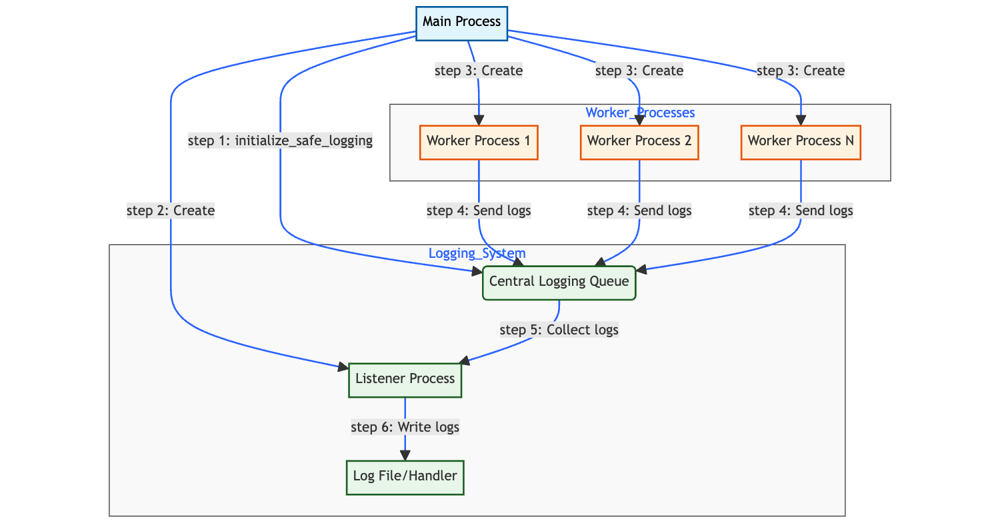

# 

`log_safe` is a Python library that provides safe and efficient logging capabilities for multiprocessing applications. It ensures that logging is thread-safe and process-safe, making it ideal for complex, multi-process Python applications.

## Features

- Thread-safe and process-safe logging
- Centralized log collection from multiple processes
- Customizable logging configurations for both listener and worker processes
- Automatic initialization of logging in child processes
- Watchdog mechanism to prevent hanging listener process daemons
- Seamless integration with Python's built-in `multiprocessing` and `concurrent.futures` modules

## Installation

You can install `log_safe` using pip:

```bash
pip install log_safe
```

## Quick Start

Here's a simple example of how to use `log_safe`:

```python
from log_safe import initialize_safe_logging
import logging
import multiprocessing

initialize_safe_logging()

def worker_function():
    logger = logging.getLogger()
    logger.info("This is a log message from a worker process")

if __name__ == "__main__":
    logger = logging.getLogger()

    logger.info("Starting main process")

    with multiprocessing.Pool(processes=2) as pool:
        pool.apply_async(worker_function)
        pool.apply_async(worker_function)

    logger.info("Main process completed")
```

## Basics

### Initialization

Before using any multiprocessing features, call `initialize_safe_logging()`:

```python
from log_safe import initialize_safe_logging

initialize_safe_logging()
```

This function sets up the logging system for safe use across multiple processes.

### Custom Configuration

You can provide custom configurations for both the listener and worker processes:

```python
from log_safe import initialize_safe_logging

listener_config = {
    'version': 1,
    'formatters': {
        'detailed': {
            'format': '%(asctime)s - %(name)s - %(levelname)s - %(message)s'
        },
    },
    'handlers': {
        'file': {
            'class': 'logging.FileHandler',
            'filename': 'app.log',
            'formatter': 'detailed',
        },
    },
    'root': {
        'level': 'INFO',
        'handlers': ['file']
    },
}

worker_config = {
    'version': 1,
    'formatters': {
        'simple': {
            'format': '%(name)s - %(levelname)s - %(message)s'
        },
    },
    'handlers': {
        'console': {
            'class': 'logging.StreamHandler',
            'formatter': 'simple',
        },
    },
    'root': {
        'level': 'DEBUG',
        'handlers': ['console']
    },
}

initialize_safe_logging(listener_config, worker_config)
```

### Using with multiprocessing.Pool

`log_safe` automatically patches `multiprocessing.Pool`, so you can use it as you normally would:

```python
import multiprocessing

def worker_function():
    logger = logging.getLogger()
    logger.info("Worker process executing")

with multiprocessing.Pool(processes=4) as pool:
    pool.map(worker_function, range(10))
```

### Using with ProcessPoolExecutor

`log_safe` also patches `ProcessPoolExecutor`, allowing for seamless integration:

```python
from concurrent.futures import ProcessPoolExecutor

def worker_function(x):
    logger = logging.getLogger()
    logger.info(f"Processing {x}")
    return x * 2

with ProcessPoolExecutor() as executor:
    results = list(executor.map(worker_function, range(10)))
```

### Using with multiprocessing.Process

When creating individual processes, use the patched `Process` class:

```python
from multiprocessing import Process

def worker_function():
    logger = logging.getLogger()
    logger.info("Individual process executing")

process = Process(target=worker_function)
process.start()
process.join()
```

## How It Works



1. `initialize_safe_logging()` sets up a central logging queue and a listener process.
2. The listener process collects log records from all worker processes and writes them to the configured handlers.
3. Worker processes are automatically initialized with a `QueueHandler` that sends log records to the central queue.
4. The library patches `multiprocessing.Pool`, `ProcessPoolExecutor`, and `multiprocessing.Process` to ensure proper logging initialization in all child processes.

# Use Cases

The following examples demonstrate various ways to use the `log_safe` library in different scenarios. These use cases cover common patterns in multiprocessing applications and show how `log_safe` can be integrated to provide robust, process-safe logging.

## 1. Basic Multiprocessing with Logging

```python
import logging
from log_safe import initialize_safe_logging
import multiprocessing

initialize_safe_logging()

def worker_function(x):
    logger = logging.getLogger()
    logger.info(f"Processing item {x}")
    return x * 2

if __name__ == "__main__":
    logger = logging.getLogger()
    logger.info("Starting multiprocessing task")

    with multiprocessing.Pool(processes=4) as pool:
        results = pool.map(worker_function, range(10))

    logger.info(f"Processing complete. Results: {results}")
```

## 2. Using ProcessPoolExecutor with Custom Logging Configuration

```python
import logging
from log_safe import initialize_safe_logging
from concurrent.futures import ProcessPoolExecutor
import math


custom_config = {
    'version': 1,
    'formatters': {
        'detailed': {
            'format': '%(asctime)s - %(processName)s - %(name)s - %(levelname)s - %(message)s'
        },
    },
    'handlers': {
        'console': {
            'class': 'logging.StreamHandler',
            'formatter': 'detailed',
        },
        'file': {
            'class': 'logging.FileHandler',
            'filename': 'calculations.log',
            'formatter': 'detailed',
        },
    },
    'root': {
        'level': 'INFO',
        'handlers': ['console', 'file']
    },
}

initialize_safe_logging(worker_config=custom_config)

def complex_calculation(x):
    logger = logging.getLogger()
    result = math.factorial(x)
    logger.info(f"Factorial of {x} is {result}")
    return result

if __name__ == "__main__":
    logger = logging.getLogger()
    logger.info("Starting complex calculations")

    with ProcessPoolExecutor(max_workers=4) as executor:
        results = list(executor.map(complex_calculation, range(10)))

    logger.info(f"Calculations complete. Results: {results}")
```

## 3. Long-Running Process with Progress Logging

```python
import logging
import time
from log_safe import initialize_safe_logging
import multiprocessing

initialize_safe_logging()

def long_running_task(duration):
    logger = logging.getLogger()
    start_time = time.time()
    while time.time() - start_time < duration:
        elapsed = time.time() - start_time
        progress = (elapsed / duration) * 100
        logger.info(f"Task progress: {progress:.2f}%")
        time.sleep(1)
    logger.info("Task completed")

if __name__ == "__main__":
    logger = logging.getLogger()
    logger.info("Starting long-running task")

    process = multiprocessing.Process(target=long_running_task, args=(5,))
    process.start()

    logger.info("Main process waiting for task to complete")
    process.join()

    logger.info("All tasks completed")
```

## 4. Error Handling and Logging in Multiple Processes

```python
import logging
from log_safe import initialize_safe_logging
import multiprocessing

initialize_safe_logging()

def error_prone_function(x):
    logger = logging.getLogger()
    try:
        if x == 5:
            raise ValueError("Error processing item 5")
        result = 10 / x
        logger.info(f"Processed item {x}, result: {result}")
        return result
    except Exception as e:
        logger.error(f"Error processing item {x}: {str(e)}")
        return None

if __name__ == "__main__":
    logger = logging.getLogger()
    logger.info("Starting error-prone tasks")

    with multiprocessing.Pool(processes=4) as pool:
        results = pool.map(error_prone_function, range(10))

    logger.info(f"All tasks completed. Results: {results}")
```

## 5. Combining Threading and Multiprocessing with Logging

```python
import logging
import threading
from log_safe import initialize_safe_logging
import multiprocessing
import time

## 5. Combining Threading and Multiprocessing with Logging
initialize_safe_logging()


def thread_function(name):
    logger = logging.getLogger(__name__)
    logger.info(f"Thread {name} starting")
    time.sleep(2)
    logger.info(f"Thread {name} finishing")


def process_function(process_name):
    logger = logging.getLogger(__name__)
    logger.info(f"Process {process_name} starting")

    threads = []
    for i in range(3):
        t = threading.Thread(target=thread_function, args=(f"{process_name}-Thread-{i}",))
        threads.append(t)
        t.start()

    for t in threads:
        t.join()

    logger.info(f"Process {process_name} finishing")


if __name__ == "__main__":
    logger = logging.getLogger(__name__)
    logger.info("Starting combined threading and multiprocessing task")

    processes = []
    for i in range(3):
        p = multiprocessing.Process(target=process_function, args=(f"Process-{i}",))
        processes.append(p)
        p.start()

    for p in processes:
        p.join()

    logger.info("All tasks completed")
```

These examples showcase the flexibility and power of `log_safe` in handling various multiprocessing scenarios while maintaining safe and consistent logging across all processes.

Note: `initialize_safe_logging()` is called at the module level in these examples. This is the recommended approach as it ensures that logging is properly initialized regardless of how the script is imported or run. The function includes internal checks to prevent multiple initializations, so it's safe to call it at the module level.

## Considerations

- Always call `initialize_safe_logging()` in the main process before creating any child processes
- worker and listener logging config are made at root level by default, take this into consideration while declaring `initialize_safe_logging(listerner, worker)` depening upon the log control you prefer
- Queue handler is always attached to worker and listener irrespective of configuration otherwise what the point in this library itself
- The library uses global variables to maintain the logging state. Be cautious when modifying global state in your application
- The watchdog mechanism will shut down the logging system if it's idle for too long (default is 10 hours). Adjust this if needed for long-running applications
- Advanced users feel free to  copy the core file and perform customized config if required 

## Scope for improvement
- Implement logging config per processes for more fine grained control
- more ways to add logging configurations
- feel free to suggest generic features if it can make this library better

## Contributing

Contributions to `log_safe` are welcome! Please submit pull requests or open issues on the GitHub repository.

## More Information on Logging
check out this brilliantly written python doc [logging cook book](https://docs.python.org/3/howto/logging-cookbook.html#logging-cookbook) recommended.

This [medium post](https://fanchenbao.medium.com/python3-logging-with-multiprocessing-f51f460b8778) inspired me write this library defintely worth a read.

checkout articles on [super fast python](https://superfastpython.com/multiprocessing-logging-in-python/#3_Use_Custom_Process-Safe_Logging_recommended) by [jason brownlee](https://www.linkedin.com/in/jasonbrownlee/overlay/contact-info/)

## License

log_safe is copyright Solaikannan pandiyan, and licensed under the MIT license. I am providing code in this repository to you under an open source license. This is my personal repository; the license you receive to my code is from me and not from my employer. See the LICENSE file for details.
